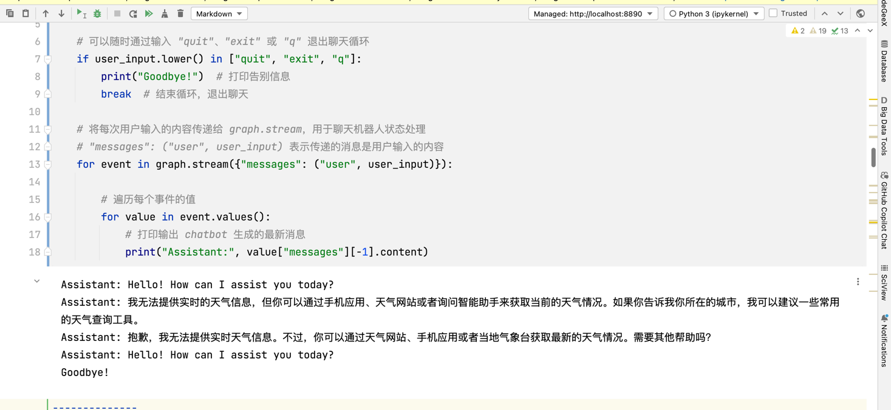

# 作业描述

- 运行和测试第 1 部分的聊天机器人（ChatBot-Only），并尝试找到一个其无法回答正确的事实性问题。
- 使用联网查询工具（如：Tavily），在第 2 部分的聊天机器人（ChatBot + Tool）上测试相同问题，并对比生成结果。


## 作业解析
### 事实性问题
- 主要包含几种,1会不会根据已训练的数据进行胡诌
- 时效性问题, 这部分问题如果没有联网肯定不知道


### 时效性问题
- 诸如天气问题



### 互联网查询
使用: serp
```bash
# 安装
pip install google-search-results
```
```python
import os
os.environ["SERPAPI_API_KEY"] = "你的token"

# 用内置tools替换chatbot的tools
from langchain.agents import load_tools
from langchain.agents import initialize_agent
from langchain.agents import AgentType

from langchain_openai import OpenAI

llm = OpenAI(model="gpt-4o-mini")

#加载 LangChain 内置的 Tools
tools = load_tools(["serpapi"], llm=llm)
```

后续相同问题提问即可