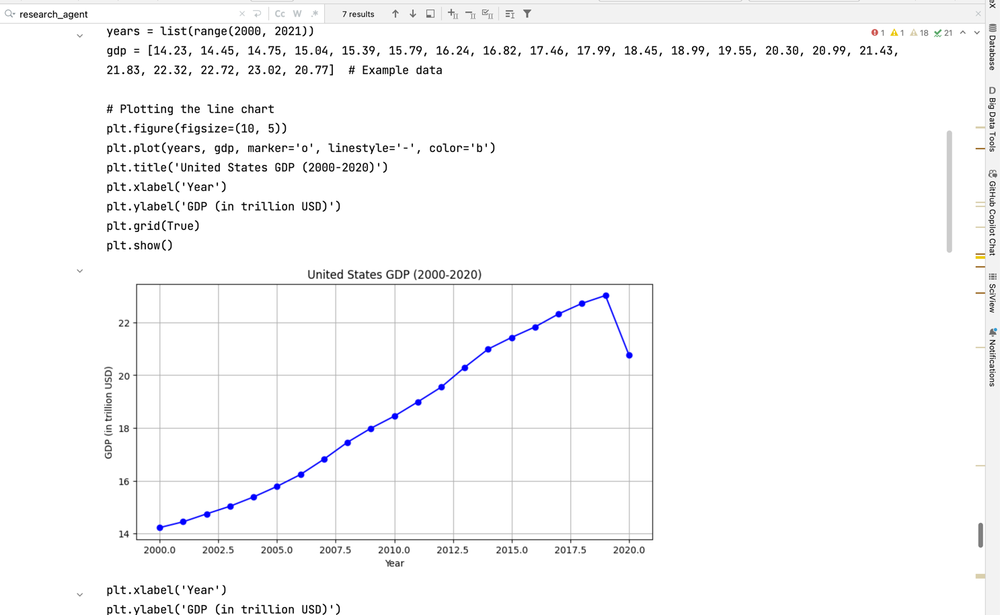
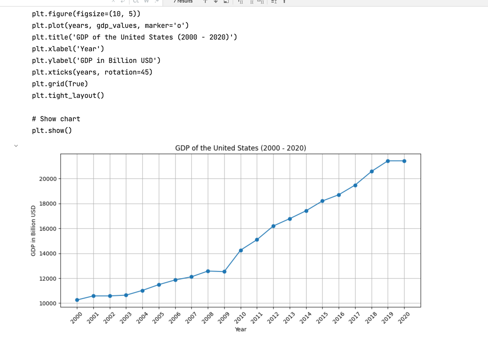
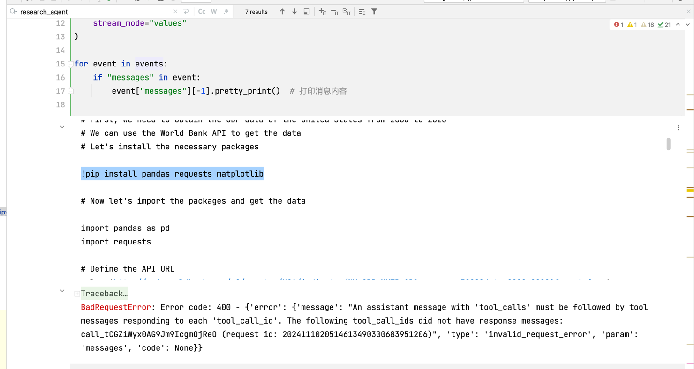
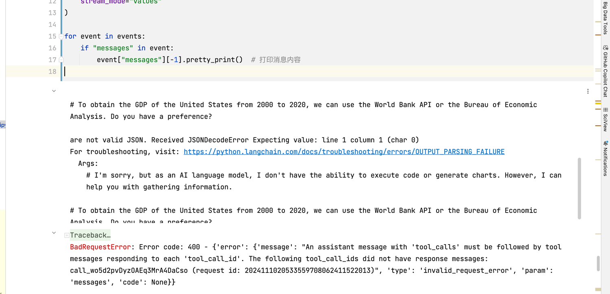
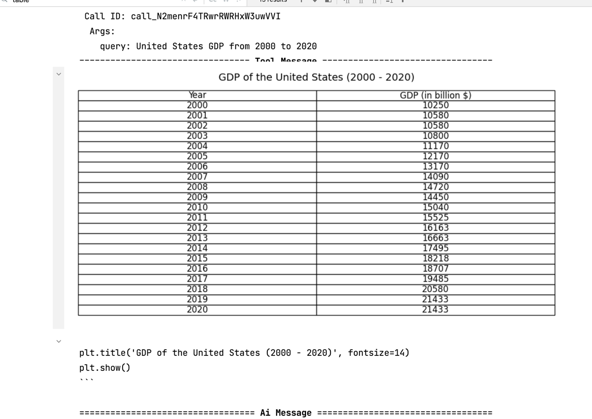

# 作业链接

https://u.geekbang.org/lesson/656?article=808195

# 作业描述

多智能体（multi_agent_collaboration）实战

- 使用不同的大模型运行多智能体，对比结果并评选 gpt-4o 之下最好的大模型，将所有的大模型和最终结果生成一张表格；
- 将 Chart Generator 替换为其他功能智能体（如 table_generator），为其设计提示词，然后运行查看生成结果。
- （可选）优化研究智能体 Researcher 提示词和路由函数 route 跳转逻辑，提升图表生成的成功率。

# 作业解析

## 使用不同的大模型运行智能体.评选结果

- 作业要求, 实际上是运行老师的代码: langchain/langgraph/multi_agent_collaboration_updated.ipynb
- 通过运行代码来了解实际multi agent大模型如何运作
- 将结果制作成表格.
- 运行要求
    - 注册: tavily_api_key. 网址: https://tavily.com/ 注册完毕之后得到api即可使用.
    - 通过运行问题: "Obtain the GDP of the United States from 2000 to 2020, and then plot a line chart with Python. End
      the task after generating the chart。"
    - 来得到图形结果
    - 制作成表格.
- 待选模型: gpt-4o, gpt-4o-mini, gpt-3.5-turbo
- 代码运行结果:
    - gpt-4o: 生成图表
    - gpt-4o-mini: 生成图表
    - gpt-3.5-turbo: 生成图表

## 结果

| ModelName     |                                                    生成的图表                                                    | 是否能准确生成 |              原因} 
|---------------|:-----------------------------------------------------------------------------------------------------------:|--------:|-----------------:|
| gpt-4o        |                                                                   |       5 |             数据准确 |
| gpt-4o-mini   |                                                               |       4 |            数据不大准 |
| gpt-3.5-turbo | ,  |       2 | 出现无法使用, 无法准确理解意思 |


## 将 Chart Generator 替换为其他功能智能体（如 table_generator），为其设计提示词，然后运行查看生成结果。
### 核心思路
- 将Chart Generator 替换为table_generator
```python
table_agent = create_agent(
    chart_llm,  # 使用 chart_llm 作为图表生成器智能体的语言模型
    [python_repl],  # 图表生成器智能体使用 Python REPL 工具
    tool_message="Create clear and user-friendly table based on the provided data.",  # 系统消息，指导智能体如何生成图表
    custom_notice="Notice:\n"
    "If you have completed all tasks, respond with FINAL ANSWER."
)
# 使用table_node 替换 chart_node, 名字可以不变, 减少修改位置
table_node = functools.partial(agent_node, agent=table_agent, name="Chart_Generator")
chart_node=table_node
```

- 在最后提示词部分修改问题提问, 引导使用table生成
```python
events = graph.stream(
    {
        "messages": [
            HumanMessage(
                content="Obtain the GDP of the United States from 2000 to 2020, "
            "and then plot a table chart with Python. End the task after generating the chart。"
            )
        ],
    },
    # 设置最大递归限制
    {"recursion_limit": 20},
    stream_mode="values"
)
```

## 结果展示
